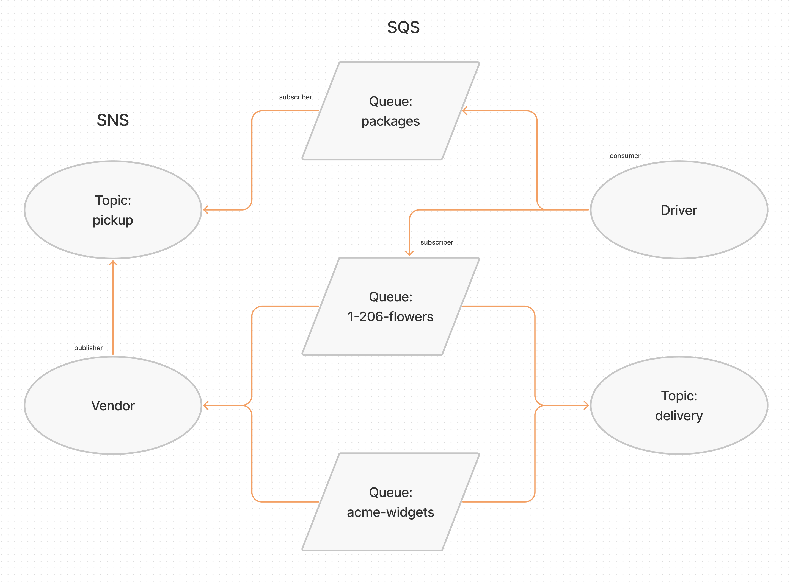

# AWS: Events

Created by Ryan Emmans

## Problem Domain

Using only AWS Services: SQS, SNS, Lambda, create a cloud version of the CAPS system

## Required Services

- SNS Topic: pickup which will receive all pickup requests from vendors
- SQS Queue (FIFO): packages which will contain all delivery requests from vendors, in order of receipt.
  - Subscribe this queue to the pickup topic so all pickups are ordered
- SQS Queue (Standard) for each vendor (named for the vendor) which will contain all delivery notifications from the drivers

## Operations

**Vendors:**

- Vendors will post “pickup” messages containing delivery information into the SNS **pickup** topic
  - `{ orderId: 1234, customer: "Jane Doe", vendorId: queueArn}`
  - Note the `queueArn` – this refers to the AWS ‘arn’ of the vendor’s specific delivered queue
- Pickup requests should be moved into a FIFO queue called **packages** for the drivers automatically
  - (Make the packages queue a subscriber to the pickup topic)
- Vendors should separately subscribe to their personal SQS queue and periodically poll the queue to see delivery notifications

**Drivers:**

- Drivers will poll the SQS **packages** queue and retrieve only the next delivery order (message)
- After a time (e.g. 5 seconds), drivers will post a message to the Vendor specific SQS Queue using the `queueArn` specified in the order object

## UML

## Links

- [CAPS SNS / SQS](https://aws.amazon.com/)
- [Pull Requests](https://github.com/ryanemmans/caps-cloud/pulls?q=is%3Apr+is%3Aclosed)

## Implementation Notes

- `vendor.js` should be an SQS Subscriber
  - Connect it to the pickup topic by using it’s URL/ARN
    - Set it up to produce a new message to the “pickup” topic every few seconds, simulating an order
      - The order id and customer name can be randomized
      - Include the ARN to the vendor’s personal delivery queue
  - Connect it to their own vendor queue by using it’s URL/ARN
  - As drivers deliver, this app will continually poll the queue, retrieve them, and log details out to the console
  - You should be able to disconnect this app, and see deliveries that happened while the app was not running
- `driver.js`
  - Connect to the **pickup** queue and get only the next package
  - Wait a random number of seconds
  - Post a message to the Vendor’s “delivered” Queue (using the supplied arn in the order/message) to alert them of the delivery
  - Repeat until the queue is empty
